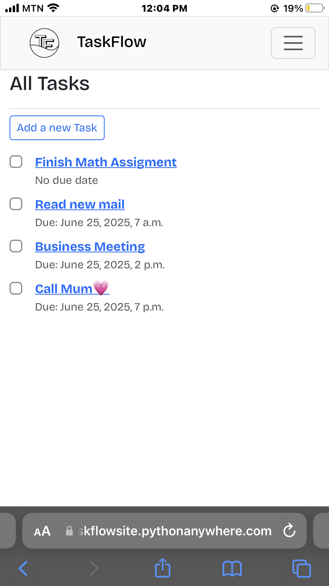

# TaskFlow – A Simple Task Management App

TaskFlow is a lightweight, minimalist Django-based task manager that helps users track tasks by due date, completion status, and priority.

---

## Preview




---

## Features

- User authentication (Login, Register, Logout)
- Task creation and editing
- Task filtering: Today, This Week, Overdue, Completed
- Responsive design using Bootstrap 5
- Custom context processors

---

## 🔧 Setup Instructions

### 1. Clone the repository

```bash
git clone https://github.com/CyrilEtornam/Task-Flow.git
cd taskflow
```

### 2. Create a virtual environment

```bash
python -m venv env
source env/bin/activate  # on Windows use: env\Scripts\activate
```

### 3. Install dependencies

```bash
pip install -r requirements.txt
```

### 4. Configure environment variables

```bash
cp .env.example .env
```

Then open `.env` and fill in your secrets:

```
DJANGO_SECRET_KEY=your-secret-key
DJANGO_DEBUG=True
```

Generate a secure key at: https://djecrety.ir/

### 5. Apply migrations and run the server

```bash
python manage.py migrate
python manage.py runserver
```

Visit `http://127.0.0.1:8000/` in your browser.

---

## Project Structure

```
├── task_manager/     # Default django-project app
├── task_app/         # Core app with tasks and views
├── users/            # User auth and registration
├── static/           # Static assets (images, CSS)
├── templates/        # HTML templates
├── .env.example      # Sample env file
├── manage.py
├── requirements.txt  # Python package list
├── runtime.txt       # Python runtime version 
```

---

## License

MIT License – feel free to use, modify, and share!

---

## Author

Built by Nyavor Cyril Etornam
Follow me on [Instagram](https://instagram.com/cyrilxetornam)
